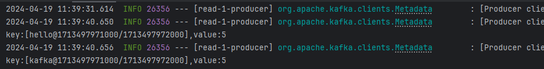
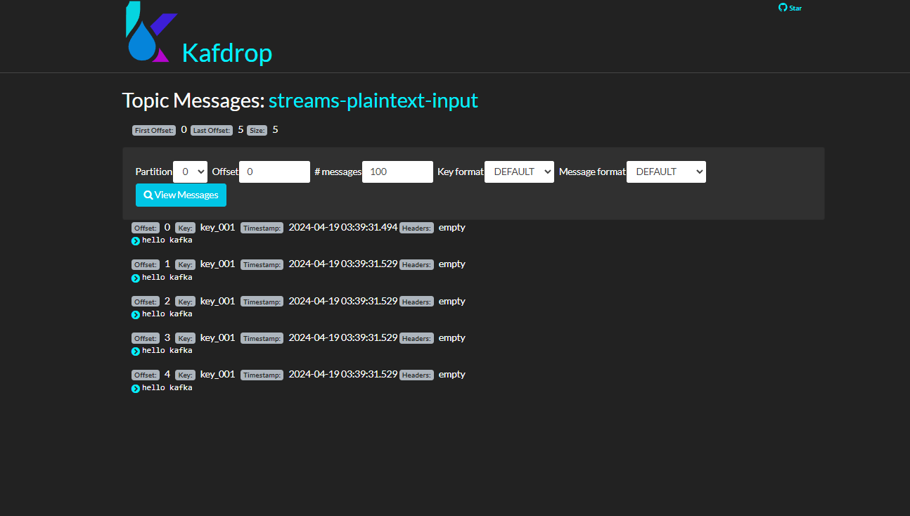

# Kafka Stream 简单示例

参考：
- https://blog.csdn.net/cold___play/article/details/132351928
- https://blog.csdn.net/zsx1713366249/article/details/132522600
- https://kafka.apache.org/37/documentation/streams/quickstart

1. 启动容器

/docs/docker-compose-app.yml 

创建Topic
```shell
./kafka-topics.sh --create --bootstrap-server localhost:9092 --topic streams-plaintext-input --replication-factor 1 --partitions 1

./kafka-topics.sh --create --bootstrap-server localhost:9092 --topic streams-wordcount-output --replication-factor 1 --partitions 1
```



